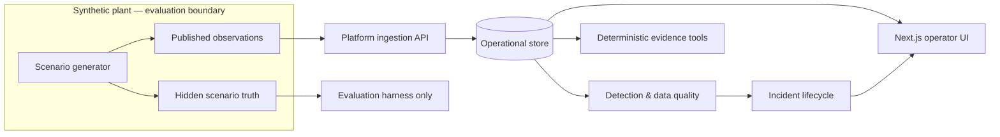

# Architecture

## Purpose and non-negotiable boundary

Sonoran Operations Intelligence models an aggregate/materials operation while demonstrating how an industrial intelligence product should behave under imperfect data. The simulator is a **data producer**, not a dependency of the platform.

The following paths are prohibited in platform runtime code (`apps/web`, `services/api`, and production deployment assets): importing from `simulator`, mounting simulator folders, reading its database/files, calling its internal APIs, or receiving truth fields in a platform contract. The simulator may call the public ingestion API or write contract-shaped fixture files. Evaluation may compare platform output to hidden truth, but cannot feed that truth back to the platform.

## Components and ownership

| Component | Owns | Must not own |
| --- | --- | --- |
| `apps/web` | Operator experience, client state, visualizations, API client use | Detection decisions, direct database access, simulation generation |
| `services/api` | Validation, persistence, query APIs, detection orchestration, incident state transitions | Scenario truth or browser rendering |
| `packages/contracts` | Platform-safe wire schemas, type generation, API versioning | Business logic, secrets, hidden fields |
| `simulator` | Deterministic scenario generation, telemetry/files/API source emulation, private truth | Platform reads or operator-facing decisions |
| `evaluation` | Scoring and regression checks against truth | Runtime ingestion/query dependency |
| `infra` | Reproducible local/service infrastructure and migrations packaging | Product logic or sample truth data |

## Runtime design

### Inputs

The ingestion boundary accepts heterogeneous observed inputs:

- telemetry batches from equipment/sensors;
- file-derived production, quality, or maintenance records;
- external/API-style observations such as dispatch, weather, or laboratory results.

Every observation records event time, ingest time, source identity, contract version, quality state, and a stable idempotency key. Missing, late, duplicate, and out-of-order events are normal operating conditions rather than simulator leaks.

### Platform services

FastAPI will expose a versioned REST interface under `/api/v1`. A single deployable API is appropriate initially; its internal modules should separate ingestion, read models, detection/data quality, incident lifecycle, and assistant retrieval. PostgreSQL is the source of truth. Time-series tables must use UTC `timestamptz`, include tenant/site/equipment dimensions as appropriate, and be designed so standard PostgreSQL works first; Timescale hypertables, compression, and continuous aggregates stay optional implementation details.

The Next.js UI communicates only with documented API endpoints. It does not inspect simulator output locations or connect to PostgreSQL directly.

### Detection, quality, and incidents

Detection output is an explainable candidate finding, not a hidden-label prediction. It records rule/model version, evaluated window, inputs used, threshold/baseline, result, confidence where applicable, and a human-readable rationale. Data quality is evaluated independently and can suppress, downgrade, or annotate findings.

Candidate findings are deduplicated into incidents. Incidents are durable operational records with a lifecycle: `open → acknowledged → investigating → mitigated → resolved`, with `dismissed` available from active states when documented. Every state change is auditable, includes actor/time/reason, and never overwrites original evidence.

### Evidence tools and governed AI analyst

The deployed public demo provides deterministic, read-only evidence tools over
platform-visible observations, findings, and incidents. They call no LLM,
execute no raw SQL, make no state mutation, and return citations plus
uncertainty notes.

An optional LLM-backed analyst is a later, separately governed capability. It
must sit behind API-owned allowlisted tools, evidence/citation validation,
identity and site scope, input/output/cost limits, audit retention, and a
human-controlled fallback. It cannot execute actions, alter records, access
raw simulator state, browse, or infer facts from evaluation truth. See
[GOVERNED_AI_ANALYST.md](GOVERNED_AI_ANALYST.md) for the required architecture
and credential boundary.

## API contract outline

Endpoints are illustrative public shapes; the backend owner will formalize OpenAPI from the schemas in `packages/contracts`.

| Method and path | Purpose | Caller |
| --- | --- | --- |
| `POST /api/v1/ingestion/observations` | Validate and idempotently accept an observation batch | Simulator/source adapters |
| `GET /api/v1/assets` | Browse platform-known sites, lines, and equipment | Web |
| `GET /api/v1/operations/briefing` | Stored-observation replay, production-series, quality, and asset-context read model | Web |
| `GET /api/v1/observations` | Filter observed time-series and records | Web, assistant tools |
| `GET /api/v1/findings` | Read explainable detection/data-quality findings | Web, assistant tools |
| `GET /api/v1/incidents` | List/filter incidents | Web, assistant tools |
| `GET /api/v1/incidents/{incident_id}` | Read incident and evidence/timeline | Web, assistant tools |
| `POST /api/v1/incidents/{incident_id}/transitions` | Apply an audited lifecycle transition | Web |
| `GET /api/v1/health` | Liveness/readiness metadata, no scenario details | Operations |

Mutating endpoints require an `Idempotency-Key` header. Pagination, filtering, sorting, error envelopes, and timestamps follow the data-contract document. No endpoint returns `hidden_truth`, `scenario_id`, fault schedules, generator seeds, expected labels, or any equivalent field.

## Cross-cutting decisions

- Use UTC for storage/wire timestamps; carry an explicit site time zone only for display.
- Preserve raw published payloads (with source metadata) separately from normalized read models when practical.
- Never silently repair data: record quality flags and transformations.
- Treat source-provided identifiers as untrusted; use server-generated record IDs plus source/idempotency keys.
- Version contracts additively. Breaking changes require a new major API path or explicitly supported migration window.
- Keep synthetic fixtures clearly labeled and outside production deployment images.
- Define every public visual against a stored field or documented calculation;
  unavailable operational values stay unavailable. See
  [VISUAL_ANALYTICS.md](VISUAL_ANALYTICS.md).
