# Governed AI analyst architecture

Sonoran provides deterministic evidence tools and an optional, server-side
evidence-chat route. The chat route calls an LLM only when the API process has
an `OPENAI_API_KEY`; otherwise it returns `503` and the deterministic tools
remain available. This document defines the implemented boundary and the
remaining controls needed before the analyst is treated as production-ready.

## Product role and non-goals

The analyst may summarize retrieved evidence, compare explicitly selected
periods, and explain data-quality caveats in plain language. It is an
investigation aid; the operator remains responsible for any decision.

It must not control equipment, write to platform records, call arbitrary URLs,
run raw SQL, infer from simulator-private truth, classify root cause as fact,
or promise safety, availability, production, or financial outcomes. In the
public portfolio deployment, it must remain read-only.

## Target request path

```mermaid
flowchart LR
  U["Authenticated or rate-limited visitor"] --> G["API analyst gateway"]
  G --> M["Input policy and moderation"]
  M --> T["Allowlisted read-only tools"]
  T --> E[("Platform evidence store")]
  E --> C["Citations and bounded evidence packet"]
  C --> L["LLM response service"]
  L --> V["Citation/claim validator"]
  V --> A["Answer, uncertainty, audit event"]
```

The model receives only the question, a fixed instruction set, and a bounded
evidence packet returned by server-owned tools. Tool output is data, never
instructions. The model does not receive database credentials, private source
payloads, hidden scenario truth, server environment variables, or unrestricted
network/file access.

## Implemented boundary

The API-owned `POST /api/v1/assistant/chat` route accepts the latest message
for a selected site, invokes only the same read-only tool registry used by the
deterministic explorer, injects server-owned site scope into each tool call,
caps the loop at three rounds and records returned by a tool at fifty, disables
provider-side response storage, and returns citations, uncertainty notes, and
tools used. Its instructions prohibit root-cause claims, safety approval,
control authority, scenario ground truth, and secret disclosure.

This is a bounded implementation, not an authorization system. The public
portfolio route is still read-only, and missing credentials fail closed. It
also enforces fixed in-process limits of **8 accepted requests per hour per
client**, **2 concurrent requests**, and **30 accepted chats per day globally
per API process**. A rejected request receives `429`. These are initial
public-demo controls: they are not distributed across API replicas, have no
environment overrides or `Retry-After` response yet, and reset when the API
process restarts. The daily request cap limits volume; it is not a daily spend
or token-budget circuit.

## Required controls before production enablement

1. **Identity and scope.** Bind every request to a site and role at the API
   boundary. Do not accept a browser-supplied site identifier as authorization.
2. **Tool allowlist.** Tools take typed arguments, strict record/time limits,
   and server-owned site filters. No raw query, URL fetch, shell, mutation, or
   tool-registry inspection path is exposed.
3. **Evidence-first answer contract.** Require citations for material claims,
   carry `uncertainty_notes`, label derived versus observed facts, and reject
   or soften unsupported claims before returning them.
4. **Prompt-injection resistance.** Treat user text and retrieved text as
   untrusted; instructions state that neither can change policy, reveal
   secrets, or authorize tools.
5. **Output and cost bounds.** Enforce request-body, input-token, output-token,
   tool-call, concurrency, timeout, and daily-budget limits at the service.
6. **Safety and quality gates.** Moderate visitor input where appropriate,
   log policy blocks, evaluate prompt-injection and citation coverage, and
   provide a deterministic fallback when the model/provider is unavailable.
7. **Audit and retention.** Record a correlation ID, authenticated principal,
   selected tools, evidence identifiers, model/config version, timestamps,
   token/cost metadata, and policy outcome. Define retention, access, and
   deletion rules before processing real customer data.
8. **Human control.** The answer suggests a next check and states uncertainty;
   it never creates, acknowledges, resolves, assigns, pages, or controls
   anything without a separately approved, authenticated workflow.

## Evaluation gates

Enablement requires a versioned offline evaluation set containing normal,
ambiguous, poor-data, no-evidence, sensitive-data, and prompt-injection cases.
Track citation precision/coverage, unsupported-claim rate, correct refusal,
tool-scope violations, latency, cost, and operator usefulness. Release only
after a reviewer can reproduce results with a fixed model/config version and
after failures have a safe plain-language fallback.

## Environment contract and existing server credential

**Current state:** the API service can read `OPENAI_API_KEY`, `OPENAI_MODEL`,
and `CHAT_SAFETY_SALT` for its evidence-chat route; the web service and
image-build arguments cannot.
The deterministic public evidence tools work without a key. Do not add a real
key to `.env`, `production.env.example`, GitHub Actions, browser-visible
`NEXT_PUBLIC_*` variables, images, logs, screenshots, or this document.

When an approved analyst implementation exists, use these server-only names:

| Variable | Required when analyst is enabled | Meaning |
| --- | --- | --- |
| `OPENAI_API_KEY` | Yes | Server-only provider credential. Never expose in a `NEXT_PUBLIC_*` variable. |
| `OPENAI_MODEL` | Yes | Approved model identifier, pinned through release configuration. |
| `CHAT_SAFETY_SALT` | Yes in production | Unique server-only salt used to derive the provider safety identifier from a client value. Production Compose rejects a missing value. |
| `AI_ANALYST_MAX_OUTPUT_TOKENS` | Future | Proposed hard response token cap; the current hard cap is implementation-controlled. |
| `AI_ANALYST_REQUEST_TIMEOUT_SECONDS` | Future | Proposed upstream timeout setting. |
| `AI_ANALYST_MAX_TOOL_CALLS` | Future | Proposed configurable tool-call ceiling; the current code uses a fixed ceiling. |
| `AI_ANALYST_MAX_INPUT_CHARS` | Future | Proposed input-size cap. |
| `AI_ANALYST_DAILY_BUDGET_USD` | Future | Proposed service-side spend circuit breaker; distinct from the implemented 30-request process-local daily cap. |

`OPENAI_API_KEY`, `OPENAI_MODEL`, and `CHAT_SAFETY_SALT` are implemented
environment names. The
`AI_ANALYST_*` names are a proposed hardening contract and are not currently
read by the backend; do not set them expecting enforcement. Add their code,
validation, tests, rate limiting, auditing, and deployment review together.

To reuse the existing server-side OpenAI credential, an authorized server
operator should securely transfer it into Sonoran's root-owned deployment
environment file without displaying it in a terminal, chat, commit, or build
log. The operator may verify only that the variable name is present, then
restart/recreate the API so the process receives it. Keep the file mode `600`;
pass only the required variable into the API container; never place it in build
arguments. Credential rotation stays owned by the existing service's
secret-management process, with Sonoran restarted after rotation. If that
credential cannot be transferred under the same access policy, provision a
separate least-privilege credential instead of copying a value between
unprotected files.

Generate the safety salt as a distinct cryptographically random value directly
in the protected deployment environment file. Do not reuse the local default,
print the resulting value, place it in a command argument, or commit it. The
model remains explicitly overridable through `OPENAI_MODEL`; use the reviewed
release value rather than relying on a provider default.

## Public-demo posture

When the production environment lacks a key, retain: **Deterministic evidence
tools; no generative model is used in this public demo.** Once a key is enabled,
state precisely: **Optional evidence chat uses a governed, read-only tool
boundary. It does not establish root cause or authorize action.** Never imply
that the remaining production-hardening controls have been completed.
